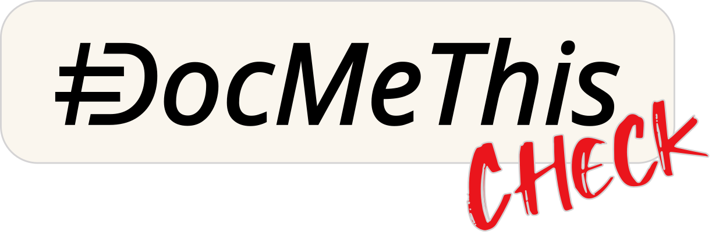

<p align="center">
  <a href="https://docmethis.com">
    <picture>
      
    </picture>
  </a>
</p>

<p align="center">
  <em>DocMeThis Check is a <a href="https://docmethis.com">DocMeThis</a> project, part of the <a href="https://github.com/orgs/DocMeThis/repositories">DocMeThis suite</a>.</em>
</p>

# DocMeThis Check

[](https://github.com/DocMeThis/docmethis-check/actions/workflows/ci.yml)
[](LICENSE)

**Keep code documentation aligned with every change.**

DocMeThis Check is not another repository-wide docstring linter, but a CI
gate that detects when a code change makes documentation stale. It parses
Python source into an Abstract Syntax Tree (AST) and extracts code facts such
as signatures, raised exceptions, and call relationships. It compares those
facts with docstrings for changed and affected symbols, then reports actionable
findings in CI.

The MVP release supports Python source files (`.py`, `.pyw`, `.pyi`) with
NumPy-style docstrings.

> **Need the fix, not just the finding?** [DocMeThis Fix](https://docmethis.com/en/ci-fix/start)
> turns Check reports into targeted, reviewable documentation patches.

```text
Code change
    -> AST-based source extraction + docstring parsing
        -> changed and affected symbols
            -> contract checks
                -> CI annotations + JSON report
```

For example, AST-based extraction can follow a new failure mode in a private
helper:

```diff
 def _read_grid(code: str) -> float:
+    if code.startswith("X"):
+        raise KeyError("price grid missing")
     return 10.0
```

Neither `load_price()` nor `apply_discount()` changed. Where a conventional docstring
linter sees only the private helper, Check follows the affected call path and
reports the public blast radius and its evidence:

```text
Affected APIs: load_price, apply_discount
New contract:  KeyError (propagated)
Evidence:      apply_discount -> load_price -> _read_grid
```

Check can now flag the stale public contracts, even across unchanged files,
without emitting a diagnostic on the private helper itself. Unrelated
documentation debt stays out of the way.

- **AST-based:** reads source structure and relationships, not just changed text.
- **Diff-first:** checks the contract affected by a change, not the whole repository (unless configured so).
- **Contract-aware:** catches drift in parameters, returns, exceptions, types, and behavior.
- **PR-native:** places warnings and errors on the relevant GitHub lines.
- **Safe by default:** never rewrites source files or existing docstrings texts.
- **Automation-ready:** emits a structured JSON report with no service or API key.

## How It Works

1. Resolve the Git diff from local changes, CI metadata, or `--git-diff`.
2. Parse Python source into an AST and extract signatures, docstrings,
   exceptions, call relationships, and other code facts.
3. Select symbols touched by changed or deleted lines, plus affected contracts.
4. Compare code facts with the documentation contract.
5. Emit direct diagnostics and, when enabled, the BASE-to-HEAD DIA report.

## Quick Start: Python MVP

### GitHub Actions

Copy the [ready-to-use workflow](.github/workflows/docmethis-check.yml) into
`.github/workflows/` in your repository. It checks documentation consistency,
adds GitHub annotations, and never invokes Fix (a Fix example is
[also available](.github/workflows/docmethis-fix.yml)). Edit the default configuration
as you wish.

> **Security note:** This workflow uses `@main`, so it follows the latest code
> on the DocMeThis Check `main` branch. This is useful for testing the action
> itself. When using the workflow in another repository, replace `@main` with
> the full commit SHA associated with the release tag you choose.

The workflow downloads your project and runs Check on every pull request. It
keeps the project's history so Check can compare the version you are submitting
with the previous version.

### Local CLI

The Check CLI requires Python 3.12+ and Git. This is the runtime for Check, not
a statement about the Python version of the project being inspected.

```bash
git clone https://github.com/DocMeThis/docmethis-check.git
cd docmethis-check
python3.12 -m venv .venv
. .venv/bin/activate
python -m pip install \
  --index-url https://pkg.docmethis.com \
  --extra-index-url https://pypi.org/simple \
  .
```

On Windows, activate the environment with `.venv\Scripts\Activate.ps1`.

Check local changes since `HEAD`:

```bash
python -m docmethis_check .
```

By default, Check writes a short human-readable report to stdout. Use
`--format json` when a script or remediation tool needs the canonical report:

```bash
python -m docmethis_check . --format json
```

To check an explicit range and save both integration outputs:

```bash
python -m docmethis_check . \
  --git-diff origin/main...HEAD \
  --json-output-file docmethis-report.json \
  --github-output-file docmethis-annotations.txt
```

`A..B` compares two revisions directly. `A...B` compares `B` with the merge
base of `A` and `B`.

### Audit an existing repository

For an initial audit of a repository that already contains code and docstrings,
run `catchup` against the empty Git tree. This makes every current Python file
part of the comparison and reports existing findings instead of only new
regressions:

```bash
CHECK_ROOT=/path/to/docmethis-check
TARGET=/path/to/repository
REPORT=docmethis-catchup.json
EMPTY_TREE="$(git hash-object -t tree /dev/null)"

uv run --project "$CHECK_ROOT" \
  python -m docmethis_check "$TARGET" \
  --git-diff "${EMPTY_TREE}..HEAD" \
  --check-mode catchup \
  --include-visibility public,protected,private \
  --symbol-kinds function,method,class,module \
  --no-dia \
  --no-cache \
  --json-output-file "$REPORT"
```

`catchup` normally remains diff-scoped. `${EMPTY_TREE}..HEAD` is a deliberate
synthetic diff that selects the whole existing repository. `--no-dia` skips
BASE-to-HEAD impact analysis, which is not meaningful for this initial audit.
This is the full finding report available in the current release.

## What the Python MVP Catches

The current Python implementation uses AST-based static extraction and catches:

- Missing docstrings on modules, classes, functions, methods, and properties.
- Missing, extra, reordered, or untyped parameters.
- Missing return values or return types.
- Raised exceptions absent from `Raises`.
- Malformed or ambiguous NumPy-style sections.
- Undocumented class attributes and missing summaries.
- Behavioral contract changes involving exceptions, I/O, inheritance,
  overrides, and affected callers.

The last category comes from **Documentation Impact Analysis (DIA)**. DIA
compares BASE and HEAD code and documentation contracts, so it can surface
changes that a signature-only checker misses. These contract concepts are not
tied to Python or one documentation syntax; the current release receives them
from the Python implementation. DIA reports whether each analysis is
`complete`, `partial`, or `inconclusive` rather than hiding missing context.

## Check Modes

| Mode | Behavior |
| --- | --- |
| `regression` | Reports only findings introduced by the change. This is the default. |
| `catchup` | Reports every finding on changed or affected symbols. |

Both modes remain diff-scoped. Check may scan the project for context, but it
does not turn every PR into a repository-wide documentation audit. Use the
empty-tree `catchup` command above for a one-time audit of an existing
repository.

## Git Diff And Base Handling

These options control which Git range Check analyzes and how it handles base
context:

- `base-ref`: base branch used when a push is non-linear.
- `git-diff`: explicit Git range; without it, Check uses local changes since `HEAD`.
- `on-missing-base`: behavior when a valid range is available but a changed file's base snapshot cannot be read. `emit_all` keeps
  current diagnostics and `fail` stops the run.
- `on-nonlinear-push-without-base`: behavior when a non-linear push has no reliable base: `fail`, `head_commit`, or `warn`.

`on-missing-base` does not make an invalid Git range usable. A missing or
invalid revision fails while the diff is being resolved, before base snapshot
fallback is considered. A newly added file is treated as having an empty base
and is not considered an unavailable snapshot.

## Configuration

Add policy to the target project's `pyproject.toml`. The repository's
[pyproject.toml](pyproject.toml) selects the `strict` built-in profile used by
this repository. Use `[tool.docmethis.check]` and the optional
`[tool.docmethis.check.severity]` section as a reference; the file also contains
this repository's own settings and is not a complete drop-in configuration for
another project.

The minimal form selects a built-in profile:

```toml
[tool.docmethis.check]
profile = "standard"
```

`loose` focuses on contract drift that can mislead readers, `standard` requires
complete documentation contracts, and `strict` enables every current rule.
Per-code values in `[tool.docmethis.check.severity]` override the selected
profile. `include-visibility` remains orthogonal to the profile, and
`check-mode` remains independent from severity.

Profiles are complete `code -> error | warning | disabled` policies, not just
lists of enabled codes. `loose` keeps missing-docstring and presentation rules
disabled and focuses on misleading contract drift. `standard` requires public
documentation and normal contract completeness while keeping presentation
findings as warnings. `strict` activates every current Check rule and promotes
additional contract and behavior gaps to errors while keeping style findings
as warnings.

Valid severity values are `error`, `warning`, and `disabled`. CLI options
override `pyproject.toml`; run `python -m docmethis_check --help` for the live
option reference.

Useful policy choices:

- `include-visibility`: `public`, `protected`, `private`.
- `symbol-kinds`: `function`, `method`, `class`, `module`.
- `property-accessors`: `getter`, `setter` (both by default); `[]` disables
  property accessor checks without disabling normal methods.
- `annotation-placement`: `signature`, `docstring`, `precise`.
- `method-exception-contract`: `callable` (default) or `class_aggregate`.
- `exclude-paths`: project-relative files or directory prefixes excluded from Check and DIA.
- `dia-exclude-paths`: project-relative files or directory prefixes excluded from DIA only.

Path filters use exact paths or directory prefixes, not glob patterns. For example,
`dia-exclude-paths = ["tests"]` keeps direct documentation checks enabled for
tests while suppressing DIA findings on test paths. Excluded files remain
available as analysis context for other files.

## Diagnostic Codes

See the [complete diagnostic code reference](docs/diagnostic-codes.md) for the
profile matrix, symbol selection, visibility scope, and fixability of each code.

Check emits native `DMT-XXXX` codes whose numbering and meaning are derived
from the proposed [Taxonomy of Documentation Violations (TDV)](https://github.com/DocMeThis/tdv-registry),
a tool-independent, language-scoped registry. For the current Python
implementation,
`DMT-2001` maps to `TDV-PY-2001`: a parameter exists in the Python signature
but is absent from the effective documentation.
`DMT-4301` is emitted only with `method-exception-contract = "class_aggregate"`:
an exposed exception from covered methods is absent from the class `Raises` section.

TDV defines what a violation means, not how to detect or handle it. Check
remains responsible for detection, confidence, severity, diff filtering,
reporting, and Fix integration. TDV is currently a proposal, with Python as its
first published language registry.

## Outputs

**GitHub annotations** place each diagnostic on the symbol signature, the
docstring, or the most precise known line. The Docker action emits annotations
directly into the workflow log and PR UI.

**Text** is the default local stdout format. Diagnostics are grouped by file and
symbol, so one source frame is shown once even when several contract findings
target the same symbol. Add `--verbose` to include useful diagnostic metadata
such as observed values, symbol visibility, and diff strategy.
Use `--ascii` for ASCII-only tree and separator glyphs.
`--annotation-placement` also controls local source frames; `precise` shows
multiple frames when one symbol has diagnostics on different target lines.
Files that cannot be analyzed are listed in the text footer with their reason;
they are not silently counted as checked files.

When stdout is an interactive terminal, the text formatter colors the status,
file and symbol locations, severities and DMT codes while keeping diagnostic
messages in the terminal's normal text color. It uses the
terminal's `COLORFGBG` hint when available; set `DOCMETHIS_COLOR_THEME=light` or
`DOCMETHIS_COLOR_THEME=dark` to override detection. Use `--color=auto|never|always`
to select automatic, disabled or forced ANSI colors. The standard `NO_COLOR`
environment variable disables colors in automatic mode. Files, JSON and GitHub
annotation output remain color-free; `--color=always` can color piped text stdout.

**JSON** is the integration contract for bots and remediation tools. Select it
with `--format json`; it contains:

- summary counts and checked files;
- structured diagnostics with `DMT-*` codes mapped to TDV;
- resolved diff metadata and completeness;
- regression-filter status;
- DIA impacts and public API differences.

The CLI can emit text or JSON on stdout. `--json-output-file` and
`--github-output-file` remain explicit file channels and suppress stdout. Exit
codes are `0` for a passing policy, `1` for blocking findings, and `2` for an
execution error.

Check writes `.docmethis_cache.json` by default to speed up extraction. The
cache is safe to delete, should stay out of Git, and can be disabled with
`--no-cache`.

## Adapters

### Available now

| | Public MVP |
| --- | --- |
| Tool runtime | Python 3.12+ |
| Code analyzed | Python source (`.py`, `.pyw`, `.pyi`) |
| Documentation | NumPy-style docstrings |
| Scope | Git diff and affected symbols |
| Delivery | CLI and Docker-based GitHub Action |
| Output | Human-readable text, GitHub annotations, and JSON report |

The runtime row describes Check itself, not the Python version used by the
project being inspected. These are the limits of the current Python support,
not of Check's intended scope.

### Immediate roadmap

The shared diff selection, code extraction, checking, policy, and reporting
layers are the foundation for adding language and documentation formats
without changing the workflow teams adopt. The next targets are:

- Google-style and reStructuredText Python docstrings;
- JavaScript and TypeScript with JSDoc;
- Java with Javadoc;
- PHP with PHPDoc;
- additional language and documentation ecosystems.

## DocMeThis Ecosystem

DocMeThis Check is the source-access detection layer of the DocMeThis solutions.
DocMeThis Fix consumes its structured report to turn each finding into a targeted 
documentation patch using the LLM of your choice:

```text
Code change
    -> DocMeThis Check
         -> JSON report + CI annotations
            -> DocMeThis Fix
                -> targeted documentation patch
                    -> review + CI verification
```

[Explore the full DocMeThis platform](https://docmethis.com), or follow the
[DocMeThis organization on GitHub](https://github.com/DocMeThis).

## FAQ

See [official FAQ](https://docmethis.com/en/faq/#ci-check).

## License

DocMeThis Check is available under the [DocMeThis Source-Access License](LICENSE).
The source is public, but permission is limited to personal or internal
organizational use and excludes third-party services or work.
